# 云计算与虚拟化技术
> Lead-Authors：刘方磊 (Amos Liu)，陈子谦 (Robert Chen)
>
> Date：2023.11.22

## Pre. 说在前面

- Docker 的基本概念相对不多，因为它本身就是一个操作导向的工具，只要操作得多，自然就记住了（Amos小声bb：其实很多命令都是相通的。例：docker xxx ps 中的xxx可以在不同使用场景达到类似效果（因为效果是ps产生的），命令记忆时应该是**docker+使用场景+效果**，而不是不经过思考的一顿背）
- 正因如此，**无论是老师们的 PPT，还是本系列文档，都不会，也无法详细涵盖到 Docker 所有的命令和参数，只会选择常用的用法参数做讲解**
- **Amos强调：一定要搭建自己的知识体系，你会发现docker的学习是很有逻辑性的，这是理工科的美感源泉，你会发现你上课的学习顺序和学习内容与docker的发展所面对和解决的问题一样是由浅入深的，逻辑也是层层递进的。**（**有了镜像的命令，你就可以用Dockerfile自己搭建定制化的镜像；有了容器的命令，你就能用Docker Compose来编排容器；面对企业生产遇到的的高并发，又产生了Docker Swarm和K8S两种方案。这样理解是不是一切都很自然了？**）
- 该复习提纲里面确实有很多链接，但**这些链接是提供给还有概念没有理解的访客的**，并不代表提纲是“不完整”的，如果你有基础并且基本功扎实，你在不跳链接的情况下Robert和Amos**保证你在这可以获得全部的考试重点**
- Robert提醒来访者一定要善用搜索工具和大模型，同时，**一定一定一定要自己操作一遍，不要死记硬背，这很重要**
- 本文档的读者大部分都是 [Rhine Assistant](https://ai.haut.ink) 的会员，谦谦给你们提供了很好的工具，你们要记得用，会用，善用

- 考试时间：11 月 29 日 — 10.15-12.15
- 试卷组成
  - 单选题：20分，共 20 题，每题 1 分
  - 多选题：10分，共 5 题，每题 2 分（少选 1 分，选错不得分）
  - 判断题：10分，共 10 道题，每题 1 分
  - 简答题：60分，共 5 道题，前 3 道题每题 10 分，后 2 道题每题 15 分

## 一、Docker 常用概念

> 该部分以及模拟题部分主要由陈子谦（Robert Chen）负责编写，其余部分主要由刘方磊（Amos Liu）大佬负责编写
>
> 谦谦要把重心放在数仓复习手册上，在这里十分感谢方磊的支持和协助

该部分不涉及命令操作，仅包含基础概念。命令部分从第二章开始

1. ### 容器技术和 Docker 核心概念

- 容器技术是一种虚拟化技术，容器本质上是一个特殊的进程。通过命名空间（Namespace）、控制组（Control groups）等技术把资源、文件、设备、状态和配置划分到一个独立的空间
- Docker的核心要素
  - 镜像：相当于一个软件包，包含了程序运行需要的所有东西
  - 容器：容器是从镜像创建的实例，同时，也可以基于容器创建镜像
  - 仓库：存放镜像的地方
- 容器技术和虚拟机的区别（**选择题**）

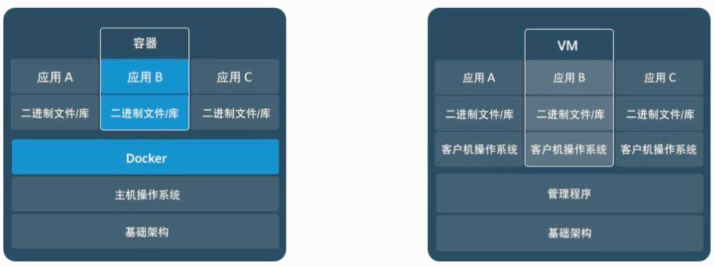

- 正因为容器化技术不需要虚拟整个硬件，而是一小部分的环境，它的整体运行速度比起虚拟机也要快得多

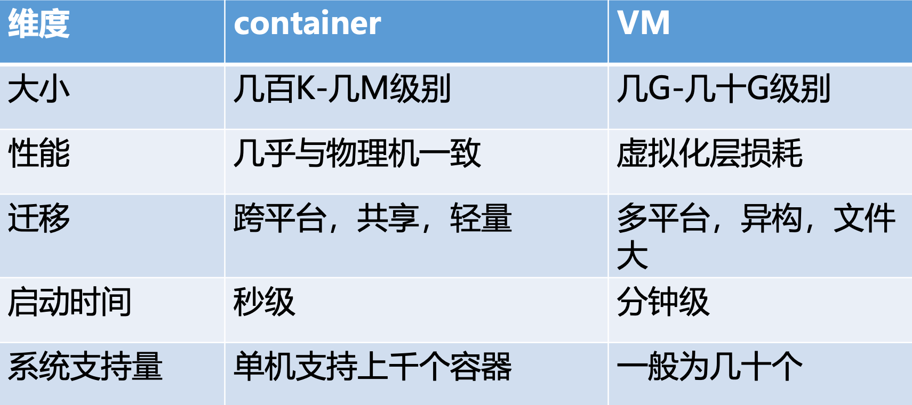

- Docker的优点（**选择题**）
  - 更快的交付与部署：消除环境差异，简化发布流程
  - 高效的资源利用与隔离：内核级虚拟化，负载低，性能优异；基于容器，保证运行环境隔离
  - 环境标准化和版本控制：保证生命周期的一致性；版本管理，快速回滚，快速启动
  - 更轻松的迁移和扩展：几乎支持在所有平台上运行，无缝迁移
  - 更简单的维护更新管理：镜像扩展简单
- Docker的应用场景：简化配置、代码流水线管理、提高开发效率、隔离应用、整合服务器、调试能力、多租户环境、快速部署等

1. ### Docker镜像管理与定制

#### A. 镜像

- 镜像提供了容器运行的必要元素和运行时的一部分参数
- 镜像是**只读**的，构建后不会被改变，一个镜像可以基于另一个镜像构建
- 容器启动时，一个可写层加载到镜像的顶部，称为容器层，也叫它读写层，所有**文件修改都会记录到读写层内**
- 联合文件系统（UnionFS）（押题课说不考，但Amos认为还是有必要理解的）：是一种为 Linux 操作系统设计的用于把多个文件系统「联合」到一个挂载点的文件系统服务
- **镜像的三个特点**
  - 分层：Docker 镜像采用分层构建，当需要修改容器镜像内的某个文件时，**只对处于最上方的读写层进行变动**，不覆写下层已有的只读文件系统的内容
  - 写时复制（是docker轻量的原因）：Docker 镜像的写时复制策略可以让**多个容器共享同一镜像**（将所有镜像层以**只读的方式挂载**到一个挂载点，再在上面覆盖一个可读写的容器层），配合分层机制可以减少磁盘空间占用和容器启动时间，只有当文件系统发生变化时，才会把变化的文件内容写到可读写层
  - 内容寻址：Docker 根据文件内容来索引镜像和镜像层，镜像的每一层都有一个独一无二的哈希校验值，不同的镜像可以共享拥有同一内容哈希值的镜像层，这样减少了ID的冲突并且增强了镜像层的共享，哈希计算机制的引入也能提升镜像的安全性和数据完整性

#### B. 容器

- 正如上面所说，容器 = 镜像 + 可写层（容器层）
- 容器是独立运行的一个或一组应用，以及它们的运行态环境，它的实质是一个进程，这点在开头也有提及
- 容器的特点：轻量级、标准、安全
- 容器通过 Namespace（命名空间）技术实现环境隔离，通过 Cgroups（控制组）技术实现资源管控，利用一系列镜像管理技术（镜像的三个特点）和镜像仓库实现多环境部署
- 再来加强一下**容器对文件操作过程**的记忆吧
  - 添加文件：新文件加入可写层
  - 读取文件：从上向下逐层查找，一旦找到，读入内存
  - 修改文件：从上上下逐层查找，一旦找到，复制到可写层，再修改
  - 删除文件：从上向下依次在各层镜像层中查找，找到后在可写层记录此删除操作
- 容器的状态
  - 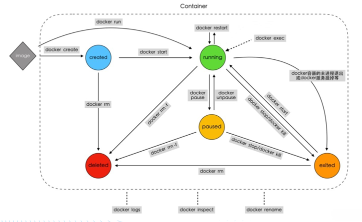
- Cgroups 支持的子系统（可能会有选择题）：`net_cls`，`net_prio`，`memory`，`cpuset`，`freezer`，`blkio`，`cpu`，`cpuacct`，`devices`

1. ### 网络

网络和数据卷部分的详细文档直达：5. Docker 容器网络与数据卷

- Docker采用 CNM 容器网络模型，他有`SandBox`，`EndPoint`和`NetWork`三要素
  - `SandBox`提供了容器运行的网络环境，`EndPoint`负责将`SandBox`与`Network`相连，其中`Network`是 Docker 内部的虚拟子网
    - 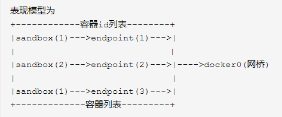
- Docker的四种网络模式
  - 桥接模式（Bridge）：Docker 默认的网络模式，每个容器有自己独立的网络空间（Network Namespace），有自己的 IP 地址。注意：桥网络下外界不能直接访问到容器，需要进行端口映射
    - 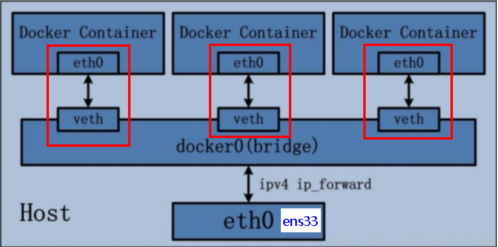
  - 主机模式（Host）：主机模式下容器直接使用宿主机的网络空间，这时候访问容器服务就不需要端口映射了
    - 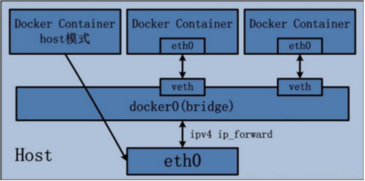
  - 容器模式（Container）：与主机模式类似，只不过使用的是一个已经存在容器的网络空间
    - 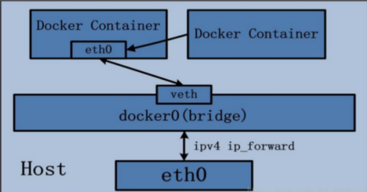
  - 无网络（None）：不对容器进行任何网络配置，需要手动配置网络（莫得图）
  - [该文档](https://hq8hgl6szr1.feishu.cn/docx/QGwIdSFLzo4iYQxoTutclEYTnsd#part-BDZXdLRJQo73kWx2xoEck8zVnsh)内有更详细的解释，基础知识不牢固的来访者可以看看
    - 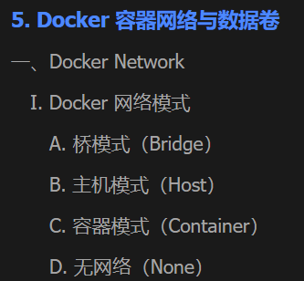

1. ### 数据卷

- 数据卷实质上是一个可供容器使用的特殊目录，它能够将宿主机操作系统中的目录直接映射给容器，通过这种方式将宿主机目录映射到容器中，类似于 Linux 系统中`mount`行为，如图所示

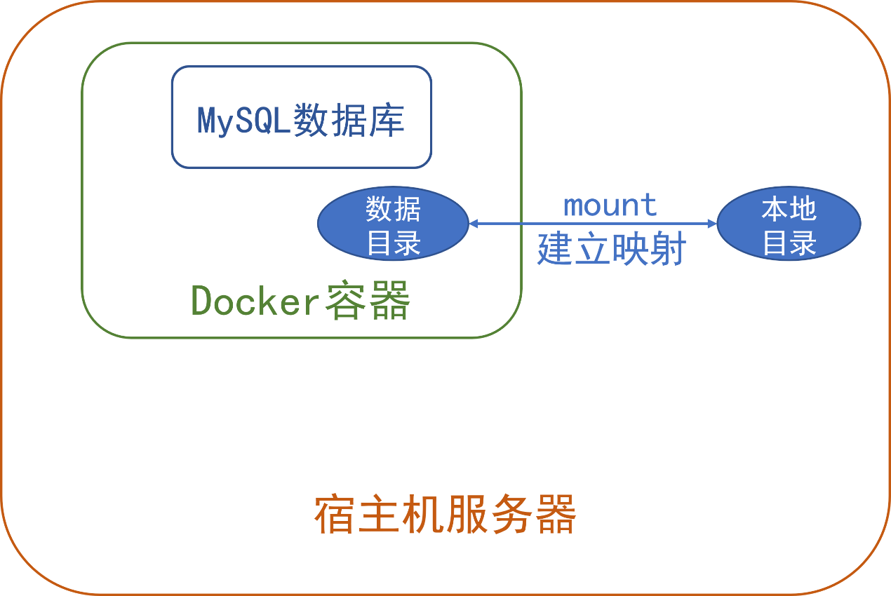

- 默认情况下，Docker容器的数据就保存在容器内，容器一旦被删除，数据也就丢失了
- 通过`Volumes`或`Bind Mounts`方式，可以将容器数据持久化到宿主机磁盘，防止丢失
  - `Volumes`方式不会覆盖容器原有文件，容器中原有的文件会被复制其中，这是默认的数据卷挂载方式。其将数据存放在主机文件系统/var/lib/docker/volumes/目录下
  - `Bind Mounts`直接在容器中挂载宿主机目录，**会隐藏容器挂载点原有文件。当指定了一个确定的宿主机挂载目录时，将使用**`Bind Mounts`
  - 区别：在使用上，两者的最大区别在于管理方式和与宿主机的关系。**Volumes由Docker管理**，与宿主机的文件系统相对隔离。**Bind mounts则由用户直接管理**，它直接映射宿主机上的文件系统。
    - 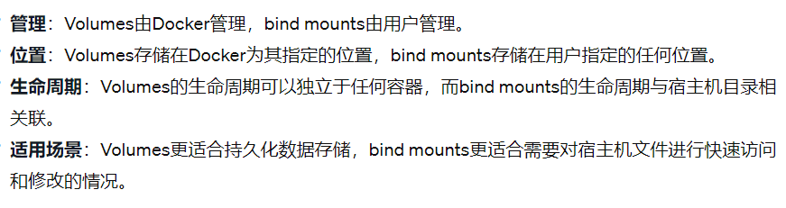
- 有一种特殊的`tmpfs`模式，它将数据暂存于内存中，重启后数据就会消失
- 在数据卷概念的基础上，实现容器中的数据管理主要有以下两种方式
  - 数据卷管理：将容器内数据直接映射到本地主机目录上，通过管理主机上的这个目录实现容器内的数据管理
  - 数据卷容器管理：构建一个专门的容器用于维护数据卷，如下图所示
  - 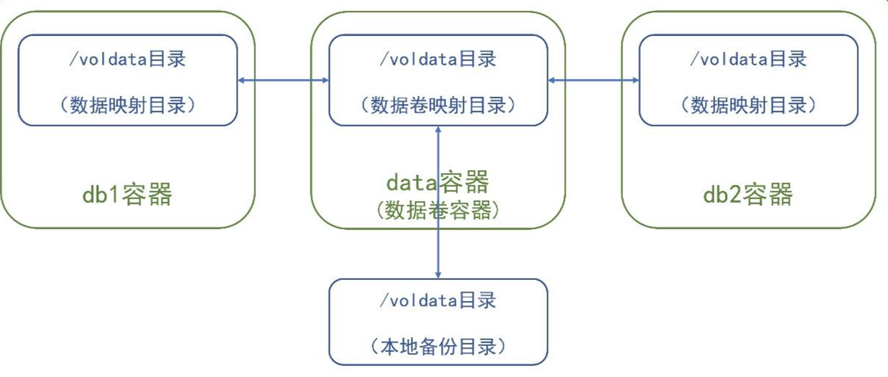
- 数据卷特性（**选择题**）
  - 容器启动时对卷初始化
  - 数据卷**可以在容器之间共用和重用**，这能够提高容器间数据传递的效率
  - 可在**容器内部或者****宿主机****本地修改数据卷内的数据，且修改立刻生效**，提高了 Docker 数据管理的效率
  - **对数据卷的更新不会影响镜像，实现了应用和数据的****解耦**，既提高了容器的稳定性，也保障了数据的安全性
  - 有独立的生命周期管理，**卷会一直存在**，直到没有容器使用，才可以安全地卸载它

1. ### 容器编排

#### A. Docker Compose

- Docker Compose 是一个用于定义和运行多个容器应用的工具，它的配置文件使用 YAML 编写
- Compose 的核心概念有二：服务和项目
  - Compose的默认管理对象是**项目**，它是由一组关联的应用容器组成的**一个完整业务单元**。一个项目可以有一个容器应用，也可以是有一组有关联的容器应用
  - 服务自然就是**每个容器了**，Compose可以通过配置文件中设定好的子命令对项目中的服务进行便捷管理

#### B. Docker Swarm

- Docker Swarm可以对 Docker 进行集群式管理和编排，将多个 Docker 宿主机组合成一个主机，使得容器可以组成跨主机的子网网络
- 它的特性：去中心化、扩容缩容、期望状态协调、多主机（Overlay）网络、服务发现、负载均衡、安全传输、滚动更新
- 一个 Swarm 集群由管理节点和工作节点组成，Swarm 相关命令基本只能在管理节点执行
- 管理节点会将服务下发到工作节点执行，同时管理节点本身也可以作为工作节点执行任务，也可以在创建服务时通过约束（`--constraint`）让服务运行在指定节点
- 一个集群可以有多个管理节点，但只能有一个管理节点成为 Leader
- Swarm 中任务和服务的关系（注意和Docker Compose 中项目和服务的区分）
  - 任务（Task）是最小的调度单位，一般就是一个单一的容器
  - 服务（Service）是一组任务的集合，有`replicated`` service`（按照一定规则在各个工作节点上运行**指定个数**的任务）和`global`` service`（每个工作节点上都运行**一个**任务）两种模式
  - 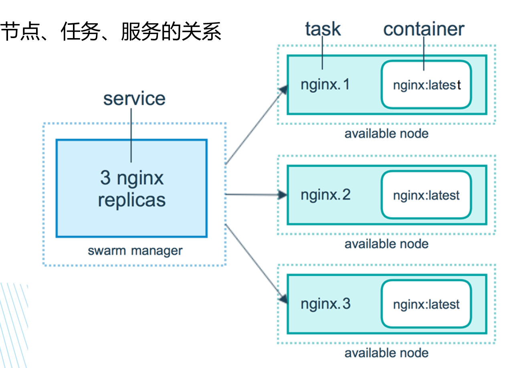
- Compose 和 Swarm 的区别就在于 Compose 是在一个宿主机上创建服务，而 Swarm 是在多个主机上创建服务
- Docker Swarm支持两种方式部署服务
  - `docker service create`：一次启动一个服务
  - `docker stack deploy`：基于Docker compose模板文件部署服务，一次性部署多个服务

#### C. Kubernetes（K8S）

- K8S 是基于 Docker 的容器集群管理系统，提升了大规模容器集群管理的便携性
- 它的主要功能：服务发现和负载均衡，存储编排，自动部署和回滚，自动装箱计算，自我修复，密钥与配置管理
- K8S核心概念
  - Pod：是最小的调度以及调度单元，由一个或多个容器组成；它定义了容器的运行方式（Command，环境变量等），提供给容器共享的运行环境
  - Replication Controller：用于管理 Pod 的副本，并提供一些高级特性如弹性伸缩，动态扩容，滚动升级等
  - Service：真实服务的抽象，定义了 Pod 逻辑上的集合和访问集合的策略
  - Deployment：定义一组 Pod 的副本数目，版本，可受 Controller 控制维持 Pod 数目，滚动升级，回滚等
  - Namespace：集群内部的逻辑隔离机制，每个资源都属于一个 Namespace，同一个 Namespace 中的资源是唯一的，不同 Namespace 中的资源可以重名
  - Label：以键值对的方式附加到各种对象上，一个对象可以定义任意数量 Label，同一个 Label 可以附加到任意数量对象上
  - Volume：定义在 Pod 上，被 Pod 内的容器共享，生命周期与 Pod 相同
  - API对象：有`metadata`（元数据），`spec`（规范），`status`（状态）三大属性，是集群中的管理操作单元
- K8S 和 Swarm 的异同：
  - 相同点：都是用于容器编排
  - 不同点：Swarm 轻量级、实施快、比较适合小规模部署；K8S 则是企业级、功能全、支撑场景多，适合做企业级大规模云方案

## 二、Docker 实操回顾

> 首先感谢陈子谦（Robert Chen）大佬的邀请，感谢谦谦在复习阶段挤出时间为广大同学们提供的无私帮助
>
> 当你看到这个引用块的时候，Amos已经将实操回顾模块施工完毕了，让大家久等了
>
> Amos真心希望来访者看操作前一定要先看完[我在Pre部分的强调](https://hq8hgl6szr1.feishu.cn/docx/Heymd2rpWoHmJnxHJgEcbWXsnHJ#part-QOTCdhEYUoDwyPxsr5Hchdwcnbc)
>
> PS：跟上小方的节奏（爆叔音）

### A. Docker 基本命令（全都重要）

- 以下复习文档内容只供总结和复习，**如果你对这个命令还不熟悉，可以点击链接查看具体使用方法**（虽然Amos建议您可以直接重开）
- 链接部分是以下文档的简单总结，需要详细案例的来访者可直接跳转按需查看
  - 2. Docker 镜像操作
  - 3. Docker 镜像构建
  - 4. Docker 容器管理与资源控制
  - 5. Docker 容器网络与数据卷

1. #### 镜像操作

1. ##### 基本操作（第一单元）

- 查找镜像：`docker search [OPTIONS] TERM`
- 拉取镜像：`docker pull [OPTIONS] NAME[:TAG|@DIGEST]`
- 查看现有镜像：`docker images [OPTIONS] [REPOSITORY[:TAG]]` 注：同一个仓库源可以有不同的tag，相当于不同的版本
- 标记镜像（**重要**）：`docker tag SOURCE_IMAGE[:TAG] TARGET_IMAGE[:TAG]` 注：

**一个镜像可以有很多个tag，但是只能有一个image ID**。如果按tag来删除的话，删掉其中一个tag，源镜像并没有被删掉，**只有当镜像所有不同tag的引用都被删除了，这个镜像才是被真正的删除！**

- 删除镜像：`docker rmi [OPTIONS] IMAGE [IMAGE...]`
- 导出镜像：`docker save [OPTIONS] IMAGE [IMAGE...]` 例：`docker save -o ./nginx_test.tar nginx:latest`
- 导入镜像：`docker load [OPTIONS]` 例：`docker load --input nginx_test.tar`

对于docker save和docker load，是否有（记忆力超群的）小伙伴想提问：“我怎么还记得有一对叫docker export和docker import的”，好像都是导入导出的，有什么区别吗？

- **docker save保存的是镜像（image），docker export保存的是容器（container），两者都导出为一个tar文件**
- **docker load用来载入镜像包，docker import用来载入容器包，但两者都会恢复为镜像**
- **docker load不能对载入的镜像重命名，而docker import可以为镜像指定新名称**
- docker export和docker save导出的tar文件是不一样的，其已经不再是一个完整的分层文件了，使用`docker history`命令看不到任何镜像构建的过程。**import导入export的文件之后有可能这个新镜像是必要的缺少环境变量的，你可以先用****`docker image inspect`****查看镜像缺少什么环境变量，然后在run时添加必要的环境变量**

- 上传镜像：`docker push [OPTIONS] NAME[:TAG|@DIGEST]` push到私服库

强调部分：

- **Docker仓库分为公共仓库和私有仓库**
- **私有仓库搭建用的是Registry镜像**
- **配置文件地址：/etc/docker/daemon.json（老师说竟然还有逆天人不知道它在哪）**
- **[私有仓库搭建过程](https://hq8hgl6szr1.feishu.cn/docx/S0svdqYUmo7pU2x52T1ct5pLnFd#part-Z4k9dJkXIoTyrfxp23tcUsUXnBd)**

1. ##### Dockerfile 镜像构建（第二单元）

只说重点，默认你会基本的Dockerfile编写，[蒟蒻戳这直接跳转](https://hq8hgl6szr1.feishu.cn/docx/VbKvd8UIooShlYx3lvdcs4oynhm#part-EGFfdQiM3oFHg7x46aBcNUocnVe)（虽然Amos认为不如直接重开）

（一切都要从docker commit不太行说起）

- 生成新镜像：`docker commit [OPTIONS] CONTAINER [REPOSITORY[:TAG]]`（**用容器生成的镜像**）
  - 参数：
    - `-m`：提交的描述信息
    - `-a`：提交的作者

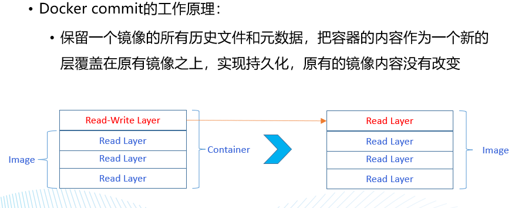

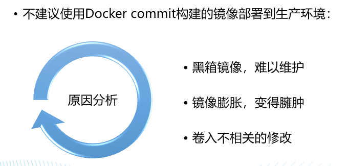

- 既然commit那么拉，那就引入Dockerfile编写规则


**你必须会的概念区分（必考）**

- CMD，ENTROPOINT，RUN三者**使用场景**的区别：
  - 使用 **RUN 指令安装应用和软件包，构建镜像**；
  - 如果 Docker 镜像的用途是运行应用程序或服务，**应该优先使用 Exec 格式的 ENTRYPOINT 指令。CMD 可为 ENTRYPOINT 提供额外的默认参数**，同时可利用 docker run 命令行替换默认参数。
  - 如果想为容器设置默认的启动命令，可使用 CMD 指令。用户可在 docker run 命令行中替换此默认命令。**即如果你在Dockerfile中以CMD的命令结尾，如果你在docker run这个镜像时使用了任何的参数，那么这个CMD指令将不再生效**
- ADD，COPY的区别：
  - **COPY指令不支持从远程URL获取资源**，只能从执行docker build所在的主机上读取资源并复制到镜像中；
  - **而ADD指令支持从远程URL获取资源**，可以通过URL从远程服务器读取资源并复制到镜像中。且**如果源是一个tar压缩文件**，压缩格式为：gzip、bzip2、xz，ADD**将自动解压文件**
- ARG，ENV的区别
  - **ARG设置的环境变量，容器运行时不存在这些环境变量**；如果在 FROM 指令之前指定，那么只能用于 FROM 指令中；默认值可以在构建命令 docker build 中用 --build-arg <参数名>=<值> 来覆盖
  - **ENV设置的环境变量，容器运行时依然存在这些环境变量**

- Dockerfile编写案例

```Dockerfile
FROM centos
MAINTAINER amos<amos@126.com>
 
ENV MYPATH /usr/local
WORKDIR $MYPATH
 
#安装vim编辑器
RUN yum -y install vim
#安装ifconfig命令查看网络IP
RUN yum -y install net-tools
#安装java8及lib库
RUN yum -y install glibc.i686
RUN mkdir /usr/local/java
#ADD 是相对路径jar,把jdk-8u171-linux-x64.tar.gz添加到容器中,安装包必须要和Dockerfile文件在同一位置
ADD jdk-8u171-linux-x64.tar.gz /usr/local/java/
#配置java环境变量
ENV JAVA_HOME /usr/local/java/jdk1.8.0_171
ENV JRE_HOME $JAVA_HOME/jre
ENV CLASSPATH $JAVA_HOME/lib/dt.jar:$JAVA_HOME/lib/tools.jar:$JRE_HOME/lib:$CLASSPATH
ENV PATH $JAVA_HOME/bin:$PATH
 
EXPOSE 80
 
 #这里只有最后一个CMD命令会被执行，且如docker run时有其他指令，这三个就都不会执行了
CMD echo $MYPATH
CMD echo "success--------------ok"
CMD /bin/bash
```

写完了Dockerfile写完了，总得build吧（）

- 基于Dockerfile构建镜像命令：`docker buildx build [OPTIONS] PATH | URL | -`
  - 常用参数
    - -f：指定Dockerfile文件位置和名称
    - -t：指定构建后的镜像名称
    - 例（**最有可能考**）：`docker build -t helloworld:first .`（以当前路径下的名为Dockerfile的文件为基础，构建名为`helloworld:first`的镜像，构建镜像上下文目录就是当前目录）

**一个最直观案例让你学会docker build的所有参数**

1、在根目录创建一个名 dockerfile_test 的新目录，在这个目录里再创建一个名为 dockerinfo 的目录

```
$ mkdir -p /dockerfile_test/dockerinfo
```

2、进入 dockerfile 目录创建一个 hello.txt，并编译内容

```
$ touch hello.txt && vim hello.txt
// 编译内容
hello docker image
```

3、创建 Dockerfile 文件 编辑创建镜像指令（注意**Dockerfile文件是可以叫其他名的**，这里叫DockerS）

```
$ touch Dockerfile && vim DockerS
// 编译文件
FROM ubuntu:latest
MAINTAINER logic
RUN mkdir /test
ADD /hello.txt /test
```

4、去到任何**其他目录**，我们都可以来试着build这个镜像

```
// 执行命令
$ docker build -f /dockerfile_test/dockerinfo/DockerS -t dockerhello /dockerfile_test/dockerinfo/
```

- 命令解析
  - /dockerfile_test/dockerinfo/DockerS :指定构建镜像的 Dockerfile 路径
  - dockerhello :镜像名称
  - /dockerfile_test/dockerinfo/ :指定的上下文路径

5、创建成功

- Docker build命令做了哪些事**（重点）**：
  - 加载Dockerfile文件
  - 对Dockerfile文件内容进行格式校验
  - 加载.dockerignore文件
  - 发送context上下文中的文件到Docker守护进程
  - Docker 守护进程收到客户端发送的包后进行解压，再根据 Dockerfile 里面的指令进行镜像的分层构建
  - 生成镜像

（好好好，你小子这么多步骤要咋理解捏）

- 加载Dockerfile：
  - 在默认情况下，如果不额外指定 Dockerfile 的话，会将上下文目录下的**名为Dockerfile的文件作为 Dockerfile**
  - Dockerfile 的文件名并不要求必须为 Dockerfile，而且并不要求必须位于上下文目录中，可以用 `-f`指定某个文件作为 Dockerfile
- `.dockerignore`是干什么的：类比`.gitignore`，docker 在构建镜像时首先从构建上下文找有没有 `.dockerignore` 文件，如果有的话则在上传上下文到 docker 服务端时忽略掉 `.dockerignore` 里面的文件列表。
- 镜像构建上下文（Context）**（重点）**：当构建的时候，用户会指定构建镜像上下文的路径，docker build 命令得知这个路径后，会将路径下的所有内容打包，然后上传给 Docker 引擎。Docker 引擎收到这个上下文包后，展开就会获得构建镜像所需的一切文件（这一段PPT文字Amos表示跟你一样看不懂并给你转了个[实践链接](https://www.cnblogs.com/FengZeng666/p/16367833.html)）。看完你就会发现：实际上Docker 构建上下文就是 Docker 客户端上传给服务端的 tar 文件解压后的内容，**也即****`docker build`****命令行最后面指定的路径下的所有（不包括在****`.dockerignore`****中的）文件被打成tar包后的结果。**
-  Docker build cache机制（[一文搞定](https://blog.csdn.net/jeorch/article/details/84402089)）：遍历本地所有镜像，发现镜像与即将构建出的镜像一致时，将找到的镜像作为 cache 镜像，复用 cache 镜像作为构建结果（**cache机制的引入，让每一次构建的每一条 Dockerfile 命令不再一定会产生一个全新的镜像层。**）
  - 查看Docker build缓存：`docker system df`
  - 清除缓存：`docker builder prune`
  - 优点：实现镜像复用、节省存储空间、加快镜像构建速度
  -  Docker build cache注意事项（如果这张图你云里雾里，具体见[一文搞定](https://blog.csdn.net/jeorch/article/details/84402089)内容）
    - 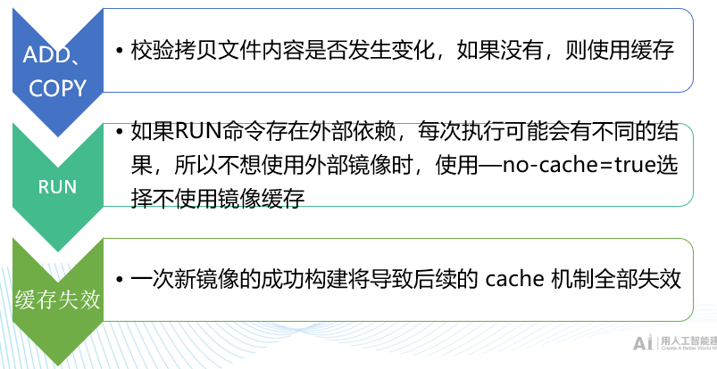
- 多阶段构建（**大幅减小构建出镜像的体积**）
  - 在一个Dockerfile中使用多个FROM指令，每个FROM都可以使用不同的基镜像，并且每条指令都将开始新阶段构建。
  - 在多阶段构建中，我们可以将资源从一个阶段复制到另一个阶段，在最终镜像中只保留我们所需要的内容
- （注：“最小化层”指RUN指令的使用时尽量连着写不要拆开）
  - 

1. #### 容器操作（第三单元）

1. ##### 容器的管理命令

（这里只说最重要的，详见[这里](https://hq8hgl6szr1.feishu.cn/docx/GsEBduojwoX38PxEpOVc9icNnWf#part-UbJNdoWBNobxiYxiiaacCVPlnih)）

- 创建并启动：`docker run [OPTIONS] IMAGE [COMMAND] [ARG...]` `OPTIONS：` `-d：后台运行容器，并返回容器ID；` `-i：以交互模式运行容器，通常与 -t 同时使用；` `-P：随机端口映射，容器内部端口随机映射到主机的端口` `-p：指定端口映射，格式为：主机(宿主)端口:容器端口` `-t：为容器重新分配一个伪输入终端，通常与 -i 同时使用`
- 查看容器：`docker ps [OPTIONS]` `OPTIONS：` `-a :显示所有的容器，包括未运行的` `-q :静默模式，只显示容器编号。` 骚操作：`docker stop $(docker ps -aq)`一键停止所有运行中的容器
- 进入容器：`docker exec [OPTIONS] CONTAINER COMMAND [ARG...]` `OPTIONS：` `-d ：分离模式: 在后台运行` `-i ：即使没有附加也保持STDIN 打开` `-t ：分配一个伪终端`
- 获取镜像、容器的元数据：`Usage: docker inspect [OPTIONS] NAME|ID [NAME|ID...]` `Options:` `-f：指定返回值的模版文件` `-s：如果类型为容器，则显示文件总大小` `--type：返回指定类型的JSON`
- 启动、终止、重启容器 启动：`docker start [OPTIONS] CONTAINER [CONTAINER...]` 终止：`docker stop [OPTIONS] CONTAINER [CONTAINER...]` 重启：`docker restart [OPTIONS] CONTAINER [CONTAINER...]` 删除：`docker rm [OPTIONS] CONTAINER [CONTAINER...]` `OPTIONS：` `-f：强制删除处于运行状态下的容器` `-v：删除容器挂载的数据卷` `-l：移除容器容器间的网络链接，而非容器本身`
- 容器导入导出
  - 导出：`docker export [OPTIONS] CONTAINER`
    - 例：`docker export my_container > container.tar`（导出的容器名称为`my_container`，使用以下命令将其导出到一个名为`container.tar`的归档文件中）
  - 导入：`docker import [OPTIONS] file|URL|- [REPOSITORY[:TAG]]`
    - 例：`docker import container.tar my_new_image`（导入名为`container.tar`的归档文件，将新镜像命名为`my_new_image`）

1. ##### （非重点）如何限制容器的资源（Cgroups）

（这里只说重点，详见[这里](https://hq8hgl6szr1.feishu.cn/docx/GsEBduojwoX38PxEpOVc9icNnWf#part-QMaedWoOrooPK2xsZvbcoJN0nge)）

- 根据英译汉意思，对Cgroups子系统有一个大概了解
  - 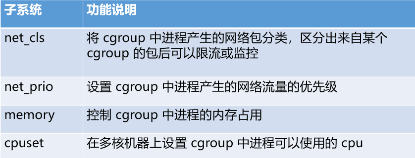
  - 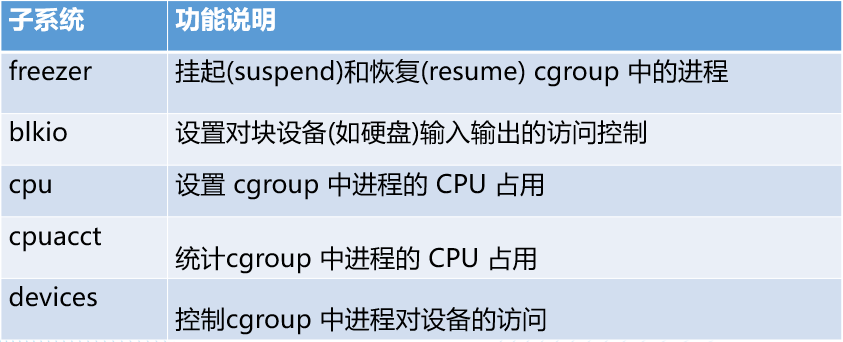
- 限制容器资源的方法（都是`docker run`命令中的参数）
  - 限制CPU（选择题）：
    - ` --cpu-shares`：这个选项设置了容器相对于其他容器的CPU优先级。（如果两个容器分别设置了`cpu-shares`为1024和2048，那么在资源紧张时，后者将获得两倍于前者的CPU时间。）
    - `--cpu-period`：用于指定容器对CPU的使用要在多长时间内做一次重新分配，单位：微秒，默认值0.1s（通常与`--cpu-quota`一起使用，用来限制容器在给定周期内可以使用的CPU时间，从而实现更细粒度的CPU资源控制。）
    - `--cpu-quota`：用于指定这个周期内，最多可以运行容器的时间；该值为绝对值，没有弹性空间，单位：微秒，默认值-1，表示不限制
      - **`--cpu-quota`****的值 <=** **`--cpu-period`****的值。如果要在多核情况下，允许容器完全占用1个CPU，可以通过将****`cpu-period、cpu-quota`****设置为相同的值：****`docker run -itd --name stress_test --cpu-period=10000 --cpu-quota=10000 progrium/stress --cpu 2`**
  - 限制内存（选择题）：
    - `--memory`：设置容器内存上限
    - `--memory-swap`：等于内存和swap分区大小的总和
      - `--memory`的值 **<=** `--memory-swap`的值。如果你设置`--memory-swap`等于`--memory`的值，这实际上禁止了容器使用swap。
      - 如果你设置`--memory-swap`为比`--memory`更大的值，容器可以使用的swap大小就是`--memory-swap`减去`--memory`的值。这意味着容器在耗尽其分配的物理内存之后，还可以使用一定量的swap空间。
      - **例如，如果你设置****`--memory=1g`****和****`--memory-swap=2g`****，这意味着容器可以使用最多1GB的物理内存和1GB的swap空间，共计2GB的内存。**

1. #### 网络与数据卷管理（第四单元）

（这里只说重点，详见[这里](https://hq8hgl6szr1.feishu.cn/docx/QGwIdSFLzo4iYQxoTutclEYTnsd#part-XOXjdXwino6OfPxA0UiczYscnhe)）

1. ##### 网络管理

- docker的网络模式（指定网络模式时，可在`docker run`命令中加入该参数）
  - 桥接模式：`--network=bridge`
  - 主机模式：`--network=host`
  - 容器模式：`--network=container:{指定共用的容器名称或ID}`
  - 无网络：`--network=none`
- 暴露端口：同一个网络的容器之间虽然可以互相ping通，但是不意味着可以任意访问容器中的任何服务，只有容器自身允许的端口，才能被其他容器所访问。
  - 暴露端口：`--expose [PORT]`
  - 指定映射：`-p {主机端口}:{容器端口}`（会同时暴露对应容器端口）
  - 随机映射：`-P`
  - 指定 IP 和端口映射：`-p {IP地址:端口}:{容器端口}`（会同时暴露对应容器端口，下面同理）
  - 指定 IP 但随机端口映射：`-p {`**`IP地址:`**`}:{容器端口}`（注意有个冒号哦）
  - 辨析：`--expose` 是声明容器内的端口用于通信，但不会创建端口映射，而 `-p` 是在宿主机和容器之间创建端口映射，使得外部可以通过宿主机的端口访问容器内部的服务。
- Docker 网络管理命令（docker network）
  - 列出所有的网络：`docker network ls [OPTIONS]`
  - 查看一个或多个网络的元数据信息：`docker network inspect [OPTIONS] NETWORK [NETWORK...]`
  - 创建网络：`docker network create {网络名称}`**默认创建的网络类型属于桥接网络（可以使用****`--driver`****参数指定别的类型，****`--subnet`****参数指定子网）**
    - 例：`docker network create --driver bridge --subnet=192.168.1.0/24 my_custom_network`
  - 连接网络：`docker network connect [OPTIONS] NETWORK CONTAINER`（其中可以使用`--ip`参数来自己设置 IP 地址（注意要在子网内））
    - 例：`docker network connect --ip=192.168.1.5 my_custom_network my_existing_container`
  - 断开网络：`docker network disconnect [OPTIONS] NETWORK CONTAINER`（其中可以使用`-f`参数强制断开）
  - 删除网络：
    - `rm`想必大家再熟悉不过，不再解释了：`docker network rm NETWORK [NETWORK...]`
    - `prune`是一个清理命令，用来清除所有**未被任何容器使用过的**网络`docker network prune [OPTIONS]`
    - 两者都可以使用`-f`参数强制删除
- 多容器互通案例请看一遍实验报告，不难，这里不再赘述
- DNS配置和pipework工具不考

1. ##### 数据卷管理

- 数据卷命令（你会发现，命令确实是相通的）
  - 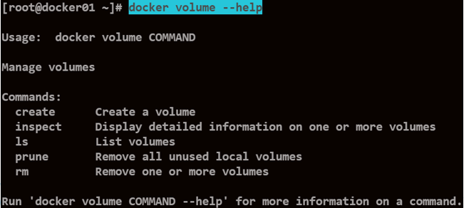
- 数据卷的创建（三种方法）
  - 运行容器时（**注意格式的区别**）：
    - `docker run -v /path/on/host:/path/in/container:ro my_image`（**ro表示只读**）
    - `docker run --mount type=<type>,source=<source>,target=<target>,readonly,<other-options>`（**注意使用k，v键值对写法**）
      - 挂载卷：`docker run --mount type=volume, source=my_volume, target=/app/data, readonly my_image`
      - 挂载目录：`docker run --mount type=bind, source=/path/on/host, target=/app/data, readonly my_image`
    - （补充，看看就行）
      - 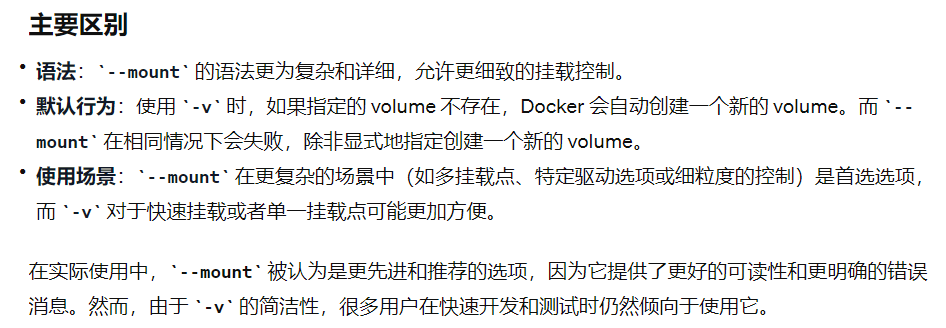
  - Dockerfile中：VOLUME指令
    - 单个数据卷：`VOLUME /data`
    - 多个数据卷：`VOLUME [“/data1”,”/data2”]`（这些数据卷是在容器中的两个挂载点）
    - Dockerfile创建的镜像，在run时若不使用`-v`参数，只能创建匿名卷（注：**匿名卷不能指定权限为只读**）
    - run时使用`-v`参数和不使用的区别：
      - 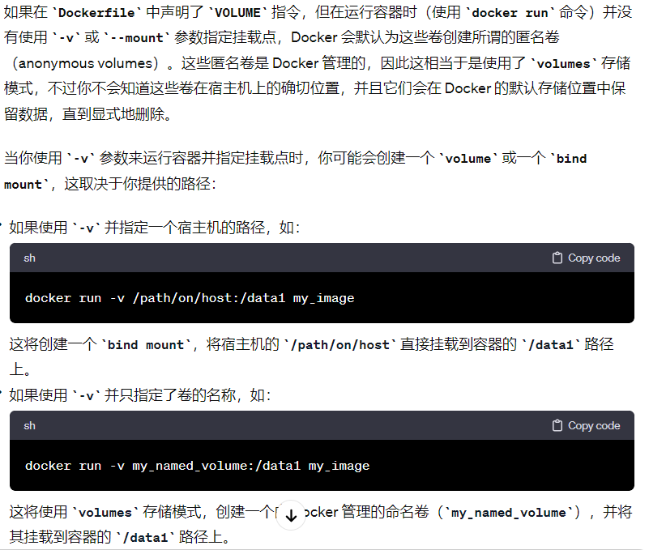
  - `Docker volume create`命令（创建的数据卷使用volumes存储模式）
- 数据卷的删除
  - `docker volume rm <volume name>`（使用`docker volume creat`创建的数据卷必须用这个命令才能删除）
  - `docker rm –v <container_name>`（删除时会把容器创建时对应的匿名数据卷进行删除，但是只删了匿名卷）
  - `docker run --rm`命令，`--rm`参数会在容器停止运行时删除容器及容器所挂载的数据卷（但是同样只删了匿名卷）
- 数据卷共享（**重点，选择题或者简答题**）
  - `--volumes-from`（让新容器和一个已经存在的容器共享数据卷）
  - [一文搞定数据卷备份和恢复](https://blog.csdn.net/qq_44895681/article/details/106072268)（或者跳转看Robert前置文档5的[这里](https://hq8hgl6szr1.feishu.cn/docx/QGwIdSFLzo4iYQxoTutclEYTnsd#part-C4VTdUjXFoBn3TxSxkGcVwvsnab)或实验报告）（**重点**）
  - 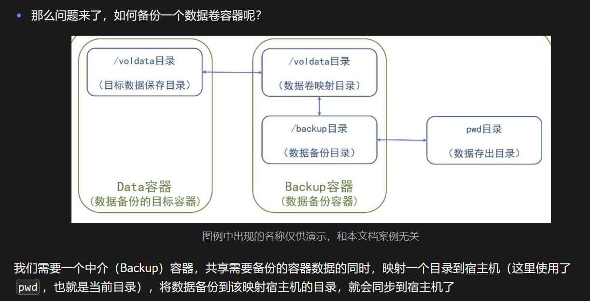
  - 数据卷恢复的注意事项（**重要**）
    - 数据恢复时，新容器挂载的数据卷要与备份的数据卷路径保持一致，才能完全恢复数据
    - 新建容器挂载的数据卷如果只是备份数据卷的一部分，则也只会恢复目录相同的这部分数据

### B. Docker 容器编排与集群管理（第五单元）

Docker Compose容器编排参考资料：6. Docker 容器编排

Docker Swarm集群管理参考资料：7. Docker 集群编排

K8S集群管理参考资料：8. 部署 K8S 集群

1. #### Docker Compose 容器编排（重要）

1. ##### Docker Compose 文件指令

（这里依旧只讲重点）

- YMAL文件编写规则

  - 大小写敏感
  - 用缩进表示层级关系，同一层级的元素左侧对齐
  - \#表示注释
  - 不支持制表符tab键的缩进，应该使用空格缩进
  - 包含的特殊字符用单引号引起来

- Docker Compose 文件必须包含两个部分：Version和Services

- 对于Version，通常使用`version: '3'`

- 对于Services

  - `image`

    - 指定镜像名称或者镜像ID
    - 如果本地不存在，compose将自动拉取镜像

  - `build`

    - 指定构建镜像的 Dockerfile 的上下文路径
    - build标签直接指定路径（绝对、相对）或者通过context标签指定路径

  - image和build的区别：image是指定直接启动一个镜像，build是指定Dockerfile的位置

  - `container_name`

    - 指定容器名称
    - Compose的容器名称默认格式：<项目名称>_<服务名称>_<序号>
    - 注：默认情况下，项目名称是包含`docker-compose.yml`文件的目录的名称，服务名称是在`docker-compose.yml`中指定的，序号按照**服务名**的不同从1开始递增

  - volumes-from

    - 设置数据卷挂载路径

    - 这是一个在Version3版本已经弃用的过时指令，Amos不明白为什么他还要讲（甚至还能在复习课上提一嘴）。推荐写法（使用volumes）：

    - ```YAML
      version: '3'
      services:
        service1:
          image: some-image
          volumes:
            - data_volume:/path/in/container
        service2:
          build: ./dir # 假设 Dockerfile 存在于 './dir' 目录
          volumes:
            - data_volume:/path/in/container
      
      volumes:
        data_volume:
      ```

  - `expose`

    - 暴露端口，但不映射到宿主机

  - `depends-on`

    - 指定容器的先后启动顺序
    - **不意味必须等待前置容器完全启动后后置容器才启动**，只是指定启动命令的先后顺序

  - `environment`

    - 设置环境变量，支持数组或字典两种格式
    - 只给定名称的变量会自动获取运行 Compose 主机上对应变量的值，防止泄露不必要的数据

- 对于Networks

  - 默认情况：docker-compose会建立一个默认的网络，名称为：docker compose文件所在目录名称小写形式加上“_default”，所有应用默认加入该网络（比如我的docker-compose.yml文件在test目录下，那我build之后就创建了一个名为 test_default 的网络）

  - 自定义：可以通过设置一级配置network来自定义网络，每个service 配置下也可以指定networks配置

  - 既可以创建新网络，又可以使用已经存在的网络

  - ```YAML
    version: '3'
    services:
      app:
        image: my-app-image
        networks:
          - front_end
          - back_end
    
      db:
        image: my-db-image
        networks:
          - back_end
    
    #这个例子中front_end是创建的新网络，back_end是已经存在的网络
    networks:
      front_end:
        driver: bridge
      back_end:
        external: true #注意必须加这一个才能认为是已经存在的网络
    ```

  - 还可以配置网络子网，指定容器IP地址

  - ```YAML
    version: '3'
    services:
      app:
        image: my-app-image
        networks:
          app_net:
            ipv4_address: 172.28.0.10
    
      db:
        image: my-db-image
        networks:
          app_net:
            ipv4_address: 172.28.0.20
    
    networks:
      app_net:
        driver: bridge
        ipam:
          driver: default
          config:
            - subnet: 172.28.0.0/16
              gateway: 172.28.0.1
    ```

1. ##### Docker Compose 管理命令

- `docker-compose [OPTIONS] COMMAND`
  - `常用OPTIONS如下：`
  - `-f：指定Compose配置文件，默认docker-compose.yml`
  - `-p：指定项目名称，默认为目录名`
- 创建和启动容器：`docker-compose up [OPTIONS] [SERVICE...]`
  - `-d`：后台运行
    - 例：`docker-compose -f docker-worldpress.yml up -d`
  - `--build`：启动容器并构建镜像（**用在你更改Dockerfile或者相关构建上下文后想重新构建时**）
- 启动服务：`docker-compose start nginx`
- 停止服务：`docker-compose stop nginx`
- 删除服务：`docker-compose rm nginx`
- 有钢筋的访客（比如Amos本人）可能会发问：我能用`docker start`替代`docker-compose start`去启动某项服务吗？
  - 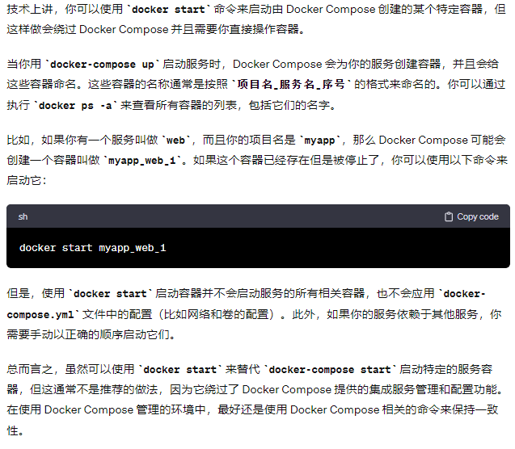

1. ##### Docker Compose 案例

> 因为是总复习，所以Amos在这里直接上多容器版本，争取能一文搞定。
>
> 对于基础薄弱的访客，请先查看[Robert提供的文档6](https://hq8hgl6szr1.feishu.cn/docx/QQhvd6CjzownrnxbLoqcsqUHnbd#part-M7rgdYCOiof1hyxlinGc2izRnid)

```YAML
version: "3" # 定义了Docker Compose文件格式的版本

services:  # 定义了将要部署的服务容器
  microService:  # 定义了名为microService的服务
    image: amos_docker:1.6 # 指定使用的镜像及其版本
    container_name: ms01 # 为容器指定一个自定义名称
    ports:
      - "6001:6001" # 将容器的6001端口映射到宿主机的6001端口
    volumes:
      - /app/microService:/data # 挂载宿主机的目录到容器的数据目录
    networks: 
      - amos_net  # 指定网络为amos_net
    depends_on: 
      - redis # 设置服务启动依赖，microService服务将在redis服务之后启动
      - mysql # microService服务将在mysql服务之后启动

  redis:  # 定义了redis服务
    image: redis:6.0.8 # 使用redis镜像及其版本
    ports:
      - "6379:6379" # 端口映射
    volumes:
      - /app/redis/redis.conf:/etc/redis/redis.conf # 将宿主机的Redis配置文件挂载到容器中
      - /app/redis/data:/data # 挂载宿主机的Redis数据目录到容器
    networks: 
      - amos_net # 指定网络为amos_net
    command: redis-server /etc/redis/redis.conf # 容器启动时运行的命令

  mysql:  # 定义了mysql服务
    image: mysql:5.7 # 指定使用的mysql镜像及其版本
    environment: # 设置环境变量，用于初始化mysql服务
      MYSQL_ROOT_PASSWORD: '123456' # 设置mysql的root用户密码
      MYSQL_ALLOW_EMPTY_PASSWORD: 'no' # 禁止空密码
      MYSQL_DATABASE: 'db2021' # 创建一个初始数据库
      MYSQL_USER: 'amos' # 创建一个用户
      MYSQL_PASSWORD: 'amos123' # 设置用户密码
    ports:
       - "3306:3306" # 端口映射
    volumes: # 数据和配置文件的挂载
       - /app/mysql/db:/var/lib/mysql
       - /app/mysql/conf/my.cnf:/etc/my.cnf
       - /app/mysql/init:/docker-entrypoint-initdb.d
    networks:
      - amos_net # 指定网络为amos_net

networks: 
   amos_net: # 定义了名为amos_net的网络
     driver: bridge # 使用bridge驱动，适用于不同容器间的通信
```

1. #### Docker Swarm 集群管理

1. ##### 查看集群的命令

- `docker node ls`
  - 节点MANAGER STATUS：
    - Leader：该节点是管理节点中的主节点，负责该集群的集群管理和编排决策（**一个Docker Swarm集群中只能有一个Leader**）
    - Reachable：该节点是管理节点中的从节点，如果 Leader 节点不可用，该节点有资格被选为新的 Leader
    - Unaviliable：该管理节点已不能与其他管理节点通信。如果管理节点不可用，应该将新的管理节点加入群集，或者将工作节点升级为管理节点
  - 节点AVAILABILITY：
    - Active：调度程序可以将任务分配给该节点
    - Pause：调度程序不会将新任务分配给该节点，但现有任务仍可以运行
    - Drain：调度程序不会将新任务分配给该节点，并且会关闭该节点所有现有任务，并将它们调度在可用的节点上
    - **一定要深刻理解Pause和Drain的区别**
- 在master节点，使用`docker info`命令查看swarm集群节点信息

1. ##### `docker node`

- 列出节点：`docker node ls`
- 改变节点角色：
  - `docker node promote work-node1 # 将work-node1节点升级为manager`
  - `docker node demote work-node1 # 将work-node1节点降级为worker`
- `删除work节点：docker node rm [id]`
- `查看节点信息：docker node inspect 主机名`

1. ##### `docker service`

- 列出服务列表：`docker service ls`
- 列出服务任务信息：`docker service ps`
- 查看服务内输出日志：`docker service logs [OPTIONS] SERVICE|TASK`
- 删除服务：`docker service rm [OPTIONS] 服务名 [SERVICE...]`
- **服务创建**：`docker service create [OPTIONS] IMAGE [COMMAND] [ARG...]`
  - 参数：
    - `--name` 给服务起名字
    - `--replicas x` 指定要运行的任务副本数x
    - `--config source=xxx,target=xxx`：使用`docker config`配置
    - `-p`：设置端口映射
- 服务扩容：`docker service scale [SERVICE=REPLICAS...]`（如果要一次性伸缩多个可以将参数之间用空格隔开）
- **更新服务（不需关停服务，热更新）**：`docker service update`
  - `docker service update --image my-image:new-version my-service`含义为更新一个名为`my-service`的 Docker 服务，将该服务使用的镜像更新为新的版本，即`my-image:new-version`。
  - `docker service update --config-rm nginx_index --config-add source=nginx_index_1,target=/usr/share/nginx/html/index.html webserver`含义为对名为 `webserver` 的服务执行以下操作：
    - 移除与 `nginx_index` 相关联的当前配置。
    - 添加一个新的配置，名为 `nginx_index_1`，并将其内容映射到服务容器的 `/usr/share/nginx/html/index.html` 路径上。
  - 滚动升级
    - 参数：可在`compose`文件中、`create`命令、`service update`命令中指定
      - 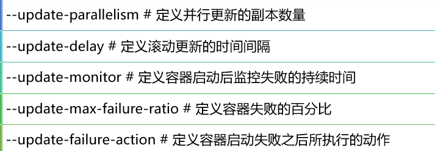
  - 回滚：`docker service update --rollback`

1. ##### `docker stack`

- 部署stack：`docker stack deploy`

  - **常用参数：**`-c`：它后面跟着的是一个 `docker-compose` 文件的路径

  - `Docker compose deploy`下的`Docker Compose`文件配置：

    - 指定与服务的部署和运行有关的配置。
    - 只在 swarm 模式和 stack 部署下才会有用。且仅支持 V3.4 及更高版本
    - Deploy下的`Docker Compose`文件不支持的参数：
      - 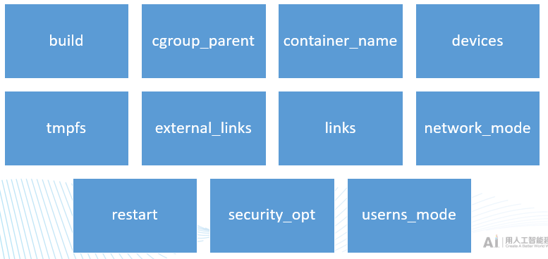

  - Deploy下的`Docker Compose` 文件的可选参数（这里只列出了重要的）：

    - `mode`：用于指定是以副本模式（默认）启动还是全局模式

    - `replicas`：用于指定副本数，只有mode为副本模式的时候生效

    - `placement`：主要用于指定约束和偏好，例如限制服务运行在那些节点上

      - `placement`的相关可选项
        - 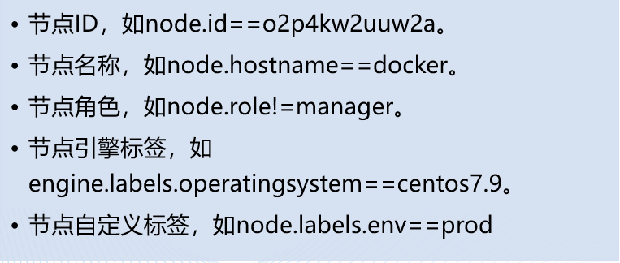

    - Deploy下的`Docker Compose`案例（不会考，加深印象用）

    - ```YAML
      version: '3.8'
      
      services:
        example_service:
          image: example/image:latest
          deploy:
            mode: replicated # 指定服务模式为 replicated，基于副本数运行
            replicas: 3
            placement:
              constraints:
                - node.id == o2p4kw2uuw2a # 只在ID为o2p4kw2uuw2a的节点上运行
                - node.hostname == wrk-12 # 只在名称为wrk-12的节点上运行
                - node.role != manager # 不在角色为manager的节点上运行
                - engine.labels.operatingsystem == ubuntu 16.04 # 只在运行Ubuntu 16.04操作系统的节点上运行
                - node.labels.zone == prod # 只在标签zone值为prod的节点上运行
      
        another_service:
          image: another/image:latest
          deploy:
            mode: global # 指定服务模式为 global，每个节点上运行一个服务副本
            placement:
              constraints:
                - node.role == worker # 即使是全局服务，你也可以限制其只在角色为worker的节点上运行
      ```

- 列出stack：`docker stack ls`

- 查看stack中的任务：`docker stack ps`

- 删除stack：`docker stack rm`

- 查看stack中的服务：`docker stack services`

- `docker stack`和`docker-compose`命令区别：

  - `docker stack`**忽略构建指令（指YAML文件里没有build指令），需要镜像预先构建好**
  - `docker stack`功能包含在引擎中，不需要安装
  - `docker stack`支持的模版文件版本至少为3
  - `docker-compose`单机模式，`stack` + `swarm`是集群模式

1. ##### `docker config`

- 创建配置：`docker config create [config_name] [tagret_file]`
- 查看配置：`docker config inspect`
- 列出配置：`docker config ls`
- 删除配置：`docker config rm`

1. #### （非重点） K8S 常用命令（第六单元）

> Amos建议访客如果看到这里了的时候时间已经非常紧迫了的话，请务必直接去看模拟题或者再复习一遍前面的
>
> Amos认为K8S考的概率非常低，考也是考极其简单的选择题，这里只列一些常用命令凑数

```Bash
# 查看当前集群的所有的节点
kubectl get node

# 显示 Node 的详细信息
kubectl describe node {节点名称}

# 查看所有的 Pod
kubectl get pod --all-namespaces

# 查看 Pod 的详细信息
kubectl get pods -o wide --all-namespaces

# 查看所有创建的服务
kubectl get service

# 查看所有的 deploy
kubectl get deploy

# 重启 pod（这个方式会删除原来的 Pod，然后再重新生成一个 Pod 达到重启的目的）
# 有 yaml文件的重启
kubectl replace --force -f {配置文件.yaml}

# 无 yaml文件的重启
kubectl get pod <POD_NAME> -n <NAMESPACE> -o yaml | kubectl replace --force -f -

# 查看 Pod 的详细信息
kubectl describe pod {Pod 名称} -n default

# 根据 yaml 文件创建 Pod
kubectl apply -f {配置文件.yml}

# 删除基于 xxx.yaml 文件定义的 Pod 
kubectl delete -f xxx.yaml

# 查看 Pod 日志
kubectl logs <pod-name>

# 实时查看日志
kubectl logs -f <pod-name>

# 查看 Pod 下某容器的日志，若 Pod 只有一个容器，可以不加 -c
kubectl log <pod-name> -c <container_name>

# 返回所有标记为 app=frontend 的 Pod 的合并日志
kubectl logs -l app=frontend

# 通过 bash 获得 Pod 中某个容器的 TTY，相当于登录容器
kubectl exec -it <pod-name> -c <container-name> -- bash

# 查看 endpoint 列表
kubectl get endpoints

# 查看已有的 token
kubeadm token list
```

## 三、谦谦模拟题

### A. 简答题（10分）

谦谦模拟-1**（考查概率：95%）**

现在有一个名为`data1`的容器，在**容器的根目录**有一个名为`volfiles`的数据卷挂载点，请你通过数据卷容器的方式将`data1`容器中的`volfiles`的内容迁移到`data2`容器的根目录**同名文件夹**内，具体说明如下

- 使用镜像均为：`centos:7`
- 数据卷容器名称可以自定义，用到的宿主机和数据卷容器的挂载目录统一指定为`/DataBackup`
- `data1`容器已经创建好，`data2`需要自己创建并设置好与`data1`相同的数据卷挂载点
- 要求数据使用`tar`打包备份，名称为`data.tar`
- 请给出整个过程中需要的 Docker 命令并附带必要说明

```Bash
# 备份数据卷过程（3分）
docker run -itd \
# 指定容器名称
--name Data1_Backup \
# 继承 data1 的挂载点
--volumes-from data1 \
# 映射备份路径
-v /DataBackup/:/DataBackup \
# 指定镜像
centos:7 \
# 指定容器启动时打包备份文件
tar cvf /DataBackup/data.tar /volfiles

# 恢复数据卷过程（7分）
# 创建 Data2 并设置相同的挂载点
docker run -itd -v /volfiles --name data2 centos:7

# 创建恢复容器
docker run -itd \
--name Data2_Restore \
--volumes-from data2 \
-v /DataBackup:/DataBackup \
centos:7 \
# 这里把文件解压到根目录，因为刚才打包的文件是包含父文件夹 volfiles 的
tar xvf /DataBackup/data.tar -C /
```

谦谦模拟-2（考查概率：25%）

Docker 创建容器时使用的默认网络模式是什么？Docker 还有哪些其他的网络模式（不考虑 Swarm 等集群技术）？他们之间的区别是什么，如何在启动容器时指定网络模式？

- 默认网络模式是`bridge`模式，除此之外还有`host`, `container`和`none`三种模式
- 指定网络模式可以在`docker run`的时候通过参数`--network`来指定
  - `--network=bridge`：桥 (bridge) 模式
  - `--network=host`：主机 (host) 模式
  - `--network=container:{指定共用的容器名称或ID}`：容器 (container) 模式
  - `--network=none`：无网络 (none) 模式

谦谦模拟-3（考查概率：15%）

Dockerfile 中 ENTRYPOINT 和 CMD 有什么区别？ADD 和 COPY 有什么区别？请简要描述

- ENTRYPOINT 指令多用于运行固定的应用程序或服务的镜像中；CMD 指令多用于设置容器默认的启动命令；当设置了 ENTRYPOINT 后，CMD 设置的内容将变为 ENTRYPOINT 指令的参数
- COPY 只能从执行`docker build`所在的宿主机上读取资源并复制到镜像中，而 ADD 在此基础上还支持从远程 URL 获取资源，且可以自动解压`tar`类压缩文件

谦谦模拟-4**（考查概率：90%）**

请你根据需求写出指定的命令

- 创建一个名为`mynet`的桥 (Bridge) 模式网络，要求子网为`10.0.0.0/16`，网关 IP 为`10.0.0.1`
- 查看这个网络的详细信息
- 使用`busybox`镜像启动一个容器，将容器连接到这个网络
- 假设有一个名为`box2`的容器，请将该容器连接到刚才创建的网络，然后断开
- 将该网络删除

```Bash
# 创建网络（默认情况创建桥模式）
docker network create --subnet 10.0.0.0/16 --gateway 10.0.0.1 mynet
# 查看详细信息
docker network inspect mynet
# 新容器加入网络
docker run -itd --net mynet busybox
# 连接和断开
docker network connect mynet box2
docker network disconnect mynet box2
# 删除网络
docker network rm mynet 
```

### B. 代码编写题（15分）

> 谦谦出的模拟题不会非常难，主要是希望来访者能通过案例理解编写的核心思想，以不变应万变

谦谦模拟-1

请编写一个 Dockerfile，实现以下功能

- 使用镜像：`centos:7`
- 设置工作目录：`/MyData`
- 设置环境变量：`APP_Maintainer = 【你的名字】`
- 安装软件包`vim`和`net-tools`
- 拷贝 Dockerfile 同目录下所有文件到工作目录下
- 声明暴露 8080 端口
- 设置 CMD，容器启动时输出上面设置的环境变量

要求在结尾加上 docker build 完整命令，镜像名称命名为 myapp:【你的名字】，假定 Dockerfile 名称不变且构建命令执行目录就在 Dockerfile 目录下

谦谦模拟-2

请通过 Docker Compose 实现容器的编排操作，要求如下

- 使用镜像：`mysql:8`
- 服务名称：`mysql`
- 容器名称：`MyDB`
- 重启策略：`always`
- 环境变量：`MYSQL_ROOT_PASSWORD=123456`
- 网络设置：`mynet`（在启动编排时创建，使用`bridge`网络模式）
- 设置端口映射：`3306:3306`
- 设置目录映射：`./data/:/var/lib/mysql`
- 设置 CMD：`--default-authentication-plugin=mysql_native_password`

```Dockerfile
# 模拟-1
FROM centos:7

WORKDIR /MyData

ENV APP_Maintainer=your_name

RUN yum install vim net-tools -y # 7分

COPY . .

EXPOSE 8080

CMD echo $APP_Maintainer # 14分

# 构建命令
# docker build -t myapp:your_name . # 15分
# 模拟-2
version: '3'

services:
  mysql:
    image: mysql:8
    container_name: MyDB
    restart: always
    environment:
      - "MYSQL_ROOT_PASSWORD=123456"
    networks:
      - mynet
    ports:
      - "3306:3306"
    volumes:
      - ./data/:/var/lib/mysql
    command:
      - --default-authentication-plugin=mysql_native_password

networks:
  mynet:
    driver: bridge
```

谦谦高难度模拟-1

请编写一个多阶段构建 Dockerfile，实现以下功能

- 第一阶段
  - 使用镜像：`node:14`，该阶段命名为`builder`
  - 设置工作目录为`/usr/src/app`
  - 将 Dockerfile 同目录下的`package.json`和`package-lock.json`复制到工作目录下
  - 执行命令`npm install`
  - 将 Dockerfile 同目录下所有文件复制到工作目录下
  - 执行命令`npm run build`
- 第二阶段
  - 使用镜像：`node:14-slim`，该阶段命名为`runner`
  - 设置工作目录同第一阶段
  - 将第一阶段中`/usr/src/app/build`中的文件复制到第二阶段的工作目录下的`build`目录
  - 声明暴露`3000`端口
  - 设置 CMD：`node build/app.js`

谦谦高难度模拟-2

请通过 Docker Compose 实现 WordPress 博客服务的搭建，要求如下

- 使用镜像：`mysql:5.7`和`wordpress:6.4.1`
- 服务名称：`mysql`和`wp`
- 对于服务`mysql`
  - 容器名称：`wpdb`
  - 重启策略：`always`
  - 环境变量
    - `MYSQL_ROOT_PASSWORD=123456`
    - `MYSQL_DATABASE=wordpress`
    - `MYSQL_USER=myblog`
    - `MYSQL_PASSWORD=888888`
  - 使用网络：`blognet`**（假定这是一个已经创建好的网络）**
  - 端口映射：`3306:3306`
  - 设置目录映射：`./mysqldata/:/var/lib/mysql`
- 对于服务`wp`
  - 容器名称：`wpblog`
  - 重启策略：`always`
  - 启动顺序：`mysql`服务优先启动
  - 环境变量
    - `WORDPRESS_DB_HOST=mysql`
    - `WORDPRESS_DB_NAME=wordpress`
    - `WORDPRESS_DB_USER=myblog`
    - `WORDPRESS_DB_PASSWORD=888888`
  - 使用网络：`blognet`
  - 端口映射：`8080:80`
  - 设置目录映射：`./wpdata:/var/www/html`

```Dockerfile
# 高难模拟-1

# 第一阶段
FROM node:14 AS builder # 1分

# 设置工作目录
WORKDIR /usr/src/app # 2分

# 使用通配符确保复制 package.json 和 package-lock.json
COPY package*.json .  # 3分

RUN npm install

# 复制整个目录文件到工作目录
COPY . .

RUN npm run build  # 7分

# 第二阶段
FROM node:14-slim AS runner # 8分

WORKDIR /usr/src/app

# 从构建阶段复制构建结果到当前阶段的工作目录
COPY --from=builder /usr/src/app/build ./build # 10分

# 声明 3000 端口
EXPOSE 3000 # 12分

# 定义CMD
CMD ["node", "build/app.js"] # 15分
# 高难模拟-2
version: '3'

services:
  mysql:
    image: mysql:5.7
    container_name: wpdb
    restart: always
    environment:
      - "MYSQL_ROOT_PASSWORD=123456"
      - "MYSQL_DATABASE=wordpress"
      - "MYSQL_USER=myblog"
      - "MYSQL_PASSWORD=888888"
    networks:
      - blognet
    ports:
      - "3306:3306"
    volumes:
      - ./mysqldata/:/var/lib/mysql
  wp:
    image: wordpress:6.4.1
    container_name: wpblog
    ports:
      - "8080:80"
    restart: always
    depends_on:
      - mysql
    networks:
      - blognet
    volumes:
      - ./wpdata:/var/www/html
    environment:
      - "WORDPRESS_DB_HOST=mysql"
      - "WORDPRESS_DB_NAME=wordpress"
      - "WORDPRESS_DB_USER=myblog"
      - "WORDPRESS_DB_PASSWORD=888888"

# 使用一个已经创建好的网络，需要设置 external 属性为 true
networks:
  blognet:
    external: true
```

虽说 docker stack 部署基本不会考，但以防万一我也放道题在这里，整体跟 Compose 几乎一致

- 使用镜像：`mysql:5.7`和`wordpress:6.4.1`
- 服务名称：`mysql`和`wp`
- 对于服务`mysql`
  - 副本数量：1
  - 约束：只运行在管理节点
  - 环境变量
    - `MYSQL_ROOT_PASSWORD=123456`
    - `MYSQL_DATABASE=wordpress`
    - `MYSQL_USER=myblog`
    - `MYSQL_PASSWORD=888888`
  - 使用网络：`blognet`**（启动编排时创建，网络模式为overlay，attachable属性为true）**
  - 端口映射：`3306:3306`
- 对于服务`wp`
  - 副本数量：2
  - 约束：只运行在工作节点
  - 环境变量
    - `WORDPRESS_DB_HOST=mysql`
    - `WORDPRESS_DB_NAME=wordpress`
    - `WORDPRESS_DB_USER=myblog`
    - `WORDPRESS_DB_PASSWORD=888888`
  - 使用网络：`blognet`
  - 端口映射：`8080:80`

```YAML
# Stack 附加题
version: '3'

services:
  mysql:
    image: mysql:5.7
    environment:
      - "MYSQL_ROOT_PASSWORD=123456"
      - "MYSQL_DATABASE=wordpress"
      - "MYSQL_USER=myblog"
      - "MYSQL_PASSWORD=888888"
    networks:
      - blognet
    ports:
      - "3306:3306"
    deploy:
      mode: replicated
      replicas: 1
      placement:
        constraints:
          - node.role == manager
  wp:
    image: wordpress:6.4.1
    ports:
      - "8080:80"
    networks:
      - blognet
    environment:
      - "WORDPRESS_DB_HOST=mysql"
      - "WORDPRESS_DB_NAME=wordpress"
      - "WORDPRESS_DB_USER=myblog"
      - "WORDPRESS_DB_PASSWORD=888888"
    deploy:
      mode: replicated
      replicas: 2
      placement:
        constraints:
          - node.role == worker

networks:
  blognet:
    driver: overlay
    attachable: true
```